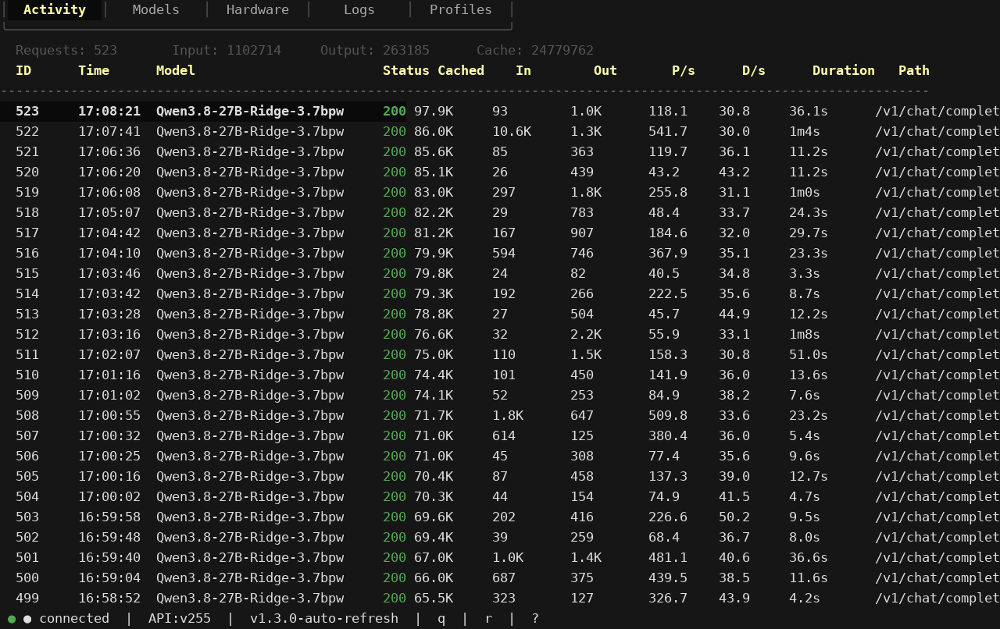
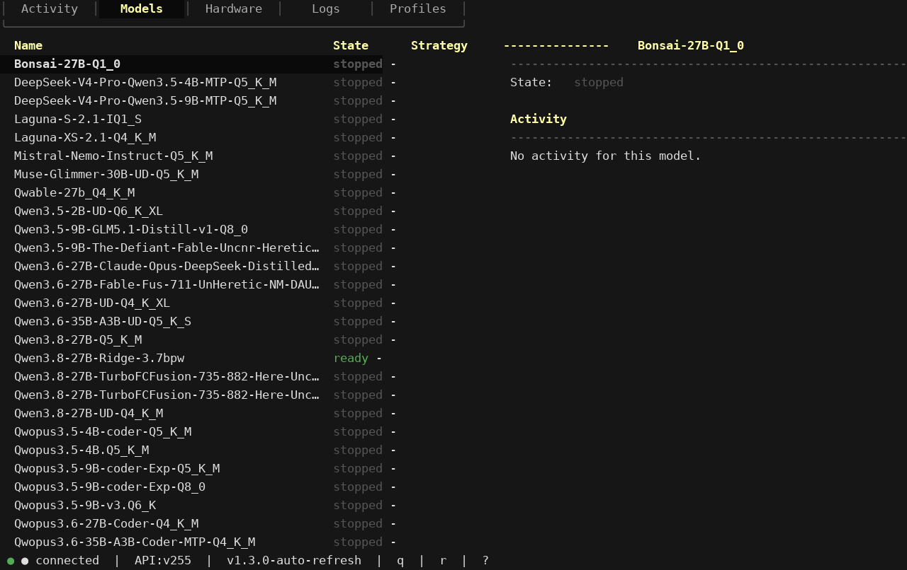
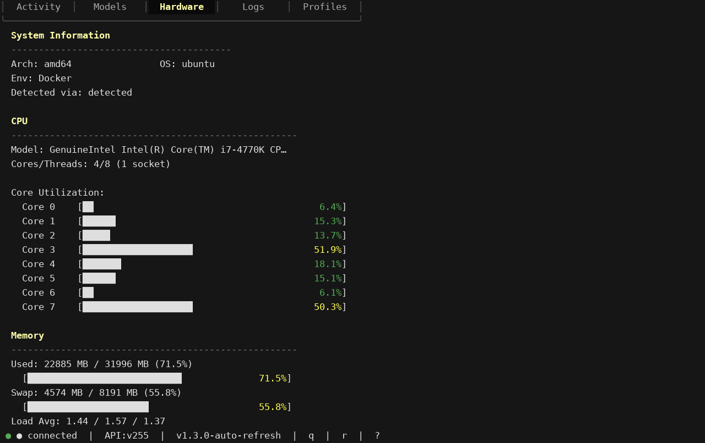
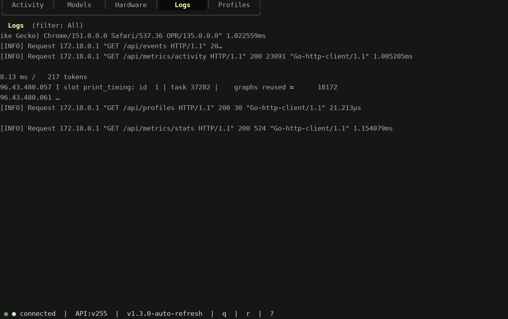
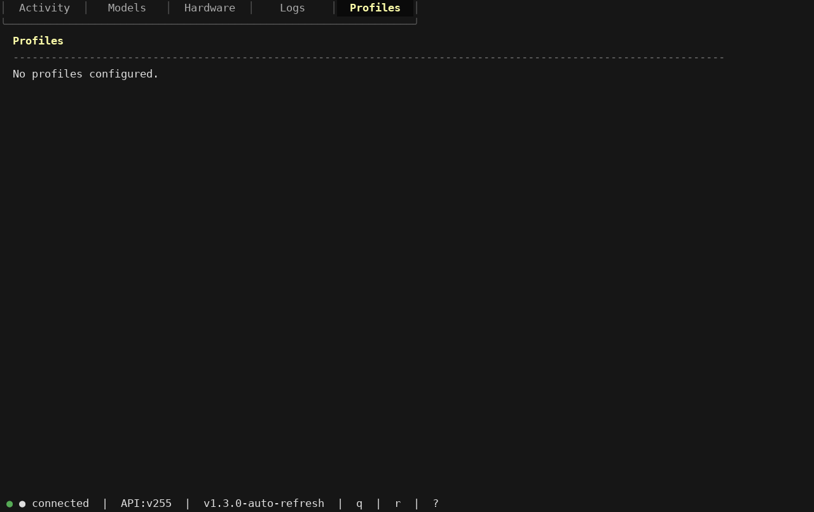

# llama-swap-tui

A terminal UI (TUI) for [llama-swap](https://github.com/binfelipe/llama-swap) — monitor model swaps, request activity, hardware stats, and more from your terminal.


## Features

- **Activity Tab** — Paginated request log with status codes, token metrics, and throughput stats; horizontal scrolling with adaptive columns that keep prefill/decode (P/s, D/s) visible on narrow terminals
- **Models Tab** — List all configured models with color-coded states (ready/starting/stopped/shutdown); load models by selection or by name, unload models, and cancel in-flight requests
- **Hardware Tab** — CPU model, core count, memory, accelerators/GPUs, per-core CPU utilization bars, memory/swap usage bars, and live multi-GPU performance (temperature, VRAM, fan speed, power draw)
- **Logs Tab** — Live streaming logs with source filtering (All / Proxy / Upstream)
- **Profiles Tab** — View and switch between named model pinning profiles
- **Real-time Updates** — SSE-powered live updates for model status, activity, in-flight requests, and logs; live hardware/GPU performance polled every 5s from `/api/performance`
- **Keyboard-driven** — Full keyboard navigation with tab-specific shortcuts

## Screenshots

### Activity Tab
Shows paginated request logs with color-coded HTTP status codes, token metrics, and throughput statistics.



### Models Tab
Lists all models with their current state, supports loading/unloading models and cancelling in-flight requests.



### Hardware Tab
Displays system information, CPU per-core utilization, memory/swap usage, GPU details, and live GPU performance metrics.



### Logs Tab
Live streaming logs with source filtering and auto-scroll.



### Profiles Tab
View and switch between model pinning profiles.



## Installation

### Prerequisites

- [Go 1.24.2](https://go.dev/dl/) or later
- A running [llama-swap](https://github.com/binfelipe/llama-swap) instance

### Build from source

```bash
git clone <repository-url>
cd llama-swap-tui
go build -o llama-swap-tui .
```

### Run

```bash
# Connect to llama-swap on default localhost:8080
./llama-swap-tui

# Connect to a custom host
./llama-swap-tui --host http://localhost:8080

# Or use the LLAMA_SWAP_URL environment variable
export LLAMA_SWAP_URL=http://your-llama-swap-host:8080
./llama-swap-tui
```

## Usage

### Keyboard Shortcuts

| Key | Action |
|---|---|
| `q` / `Ctrl+C` | Quit the TUI |
| `r` | Refresh the current tab |
| `?` | Toggle the help overlay |
| `1` | Switch to Activity tab |
| `2` | Switch to Models tab |
| `3` | Switch to Hardware tab |
| `4` | Switch to Logs tab |
| `5` | Switch to Profiles tab |
| `Tab` / `Shift+Tab` | Next / Previous tab |

### Tab-specific shortcuts

#### Activity (Tab 1)
| Key | Action |
|---|---|
| `j` / `Down` | Scroll down |
| `k` / `Up` | Scroll up |
| `←` / `→` | Horizontal scroll |
| `PageDown` / `Ctrl+D` | Next page |
| `PageUp` / `Ctrl+U` | Previous page |

#### Models (Tab 2)
| Key | Action |
|---|---|
| `j` / `Down` | Select next model |
| `k` / `Up` | Select previous model |
| `l` | Load selected model |
| `L` | Load model by name (prompt) |
| `u` | Unload selected model |
| `x` | Cancel selected in-flight request |

#### Hardware (Tab 3)
| Key | Action |
|---|---|
| `j` / `Down` | Scroll down |
| `k` / `Up` | Scroll up |
| `PageDown` / `Ctrl+D` | Page down |
| `PageUp` / `Ctrl+U` | Page up
| `r` | Refresh hardware + performance |

#### Logs (Tab 4)
| Key | Action |
|---|---|
| `f` | Cycle source filter (All → Proxy → Upstream → All) |
| `End` | Scroll to bottom of logs |

#### Profiles (Tab 5)
| Key | Action |
|---|---|
| `j` / `Down` | Select next profile |
| `k` / `Up` | Select previous profile |
| `Enter` | Switch to selected profile |

## Architecture

```
llama-swap-tui/
├── main.go              # Entry point, CLI flags, signal handling
├── api/
│   ├── types.go         # Go type definitions for llama-swap API
│   └── client.go        # SSE client + REST client
└── tui/
    ├── app.go           # Main Bubbletea model, view, key handling
    ├── activity.go      # Activity tab rendering
    ├── models.go        # Models tab rendering
    ├── hardware.go      # Hardware tab rendering
    ├── logs.go          # Logs tab rendering
    └── profiles.go      # Profiles tab rendering
```

### API Layer

The `api` package provides two communication channels to llama-swap:

- **SSE (Server-Sent Events)** — Real-time stream at `/api/events` with 8 event types: `modelStatus`, `logData`, `activity`, `inflight`, `uiConfig`, `profileChanged`, `perfsys`, `perfgpu`
- **REST API** — HTTP GET/POST/PUT for fetching and mutating state (models, profiles, activity, hardware, etc.)

### TUI Layer

Built with [Bubbletea](https://github.com/charmbracelet/bubbletea) using the MVU (Model-View-Update) pattern:

- **Model** — Holds all application state (models, activity, hardware, logs, profiles)
- **View** — Renders the current tab content with lipgloss styling
- **Update** — Processes keyboard input, SSE events, and HTTP responses as messages

## Dependencies

| Package | Purpose |
|---|---|
| `github.com/charmbracelet/bubbletea` | Terminal UI framework (MVU pattern) |
| `github.com/charmbracelet/bubbles` | TUI components (viewport, help, key bindings) |
| `github.com/charmbracelet/lipgloss` | Terminal styling and layout |

## License

MIT
